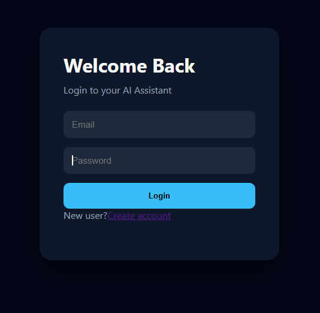
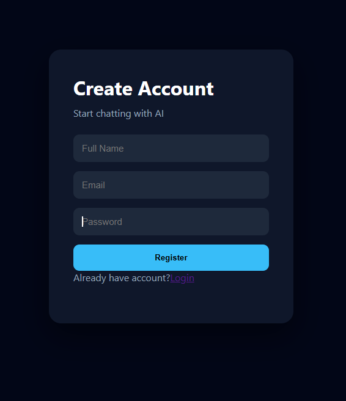
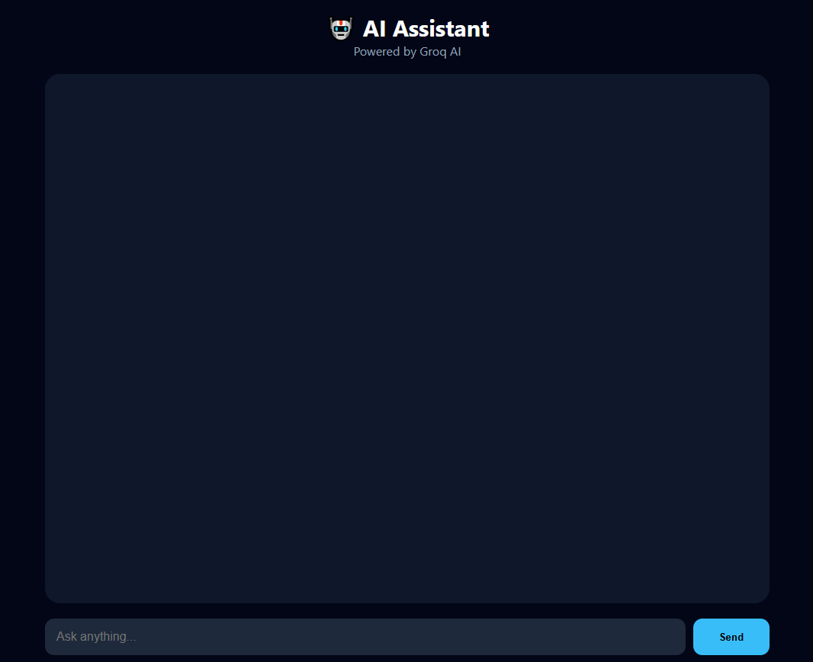
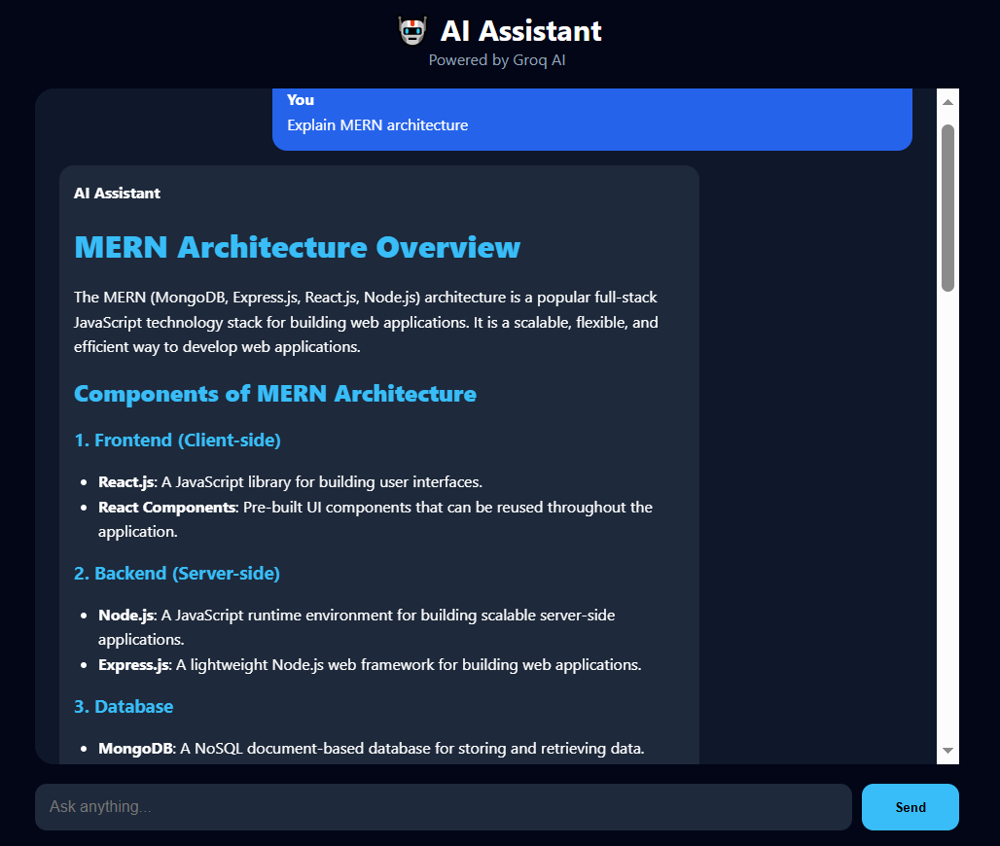

# NexaChat

A full-stack AI chatbot built with the **MERN stack** and **Groq AI**. Users can register, log in securely, and chat with an AI assistant that replies with structured, markdown-formatted answers. Chat history is saved per user in MongoDB.

---
## ✨ Features

- User registration and login with **JWT authentication**
- Passwords hashed with **bcrypt**
- Protected API routes via auth middleware
- AI responses powered by **Groq** (fast LLM inference)
- Markdown rendering (headings, lists, tables, code blocks) using `react-markdown` + `remark-gfm`
- Persistent chat history stored in MongoDB
- Dark, responsive chat UI
- 🔊 **Voice playback**: listen to any AI reply (Web Speech API)
- 🎤 **Voice input**: speak your message (Chrome / Edge)
- 🎨 **Image generation**: tap 🎨 or type `/imagine a cat in a space suit` (free Pollinations service, no key needed)
- Soft pastel UI theme
- Copy button on AI replies, clear-chat and logout controls
- Rate limiting on auth and chat routes
- Configurable Groq model via `GROQ_MODEL`

---

## 📸 Screenshots

| Login | Register |
|-------|----------|
|  |  |

| Chat Interface | Structured AI Response |
|----------------|------------------------|
|  |  |

---

## 🛠 Tech Stack

| Layer | Technologies |
|-------|--------------|
| Frontend | React 19, Vite, React Router, Axios, React Markdown |
| Backend | Node.js, Express 5, Mongoose |
| Database | MongoDB (Atlas or local) |
| Auth | JSON Web Tokens, bcrypt |
| AI | Groq API (`groq-sdk`) |

---

## 📁 Project Structure

```
AI-Chatbot-MERN
├── client                  # React frontend (Vite)
│   └── src
│       ├── components      # ChatBox, Message, Navbar, Sidebar
│       ├── pages           # Login, Register, Chat
│       ├── services        # Axios API instance
│       └── App.jsx
│
├── server                  # Express backend
│   ├── config              # MongoDB connection
│   ├── controllers         # auth + chat logic
│   ├── middleware          # auth + error handling
│   ├── models              # User, Chat
│   ├── routes              # /api/auth, /api/chat
│   ├── utils               # token generator, Groq service
│   └── server.js
│
└── screenshots
```

---

## 🚀 Getting Started

### Prerequisites

- [Node.js](https://nodejs.org/) v18+
- A [MongoDB Atlas](https://www.mongodb.com/atlas) connection string (or local MongoDB)
- A free [Groq API key](https://console.groq.com/keys)

### 1. Clone the repository

```bash
git clone https://github.com/kritikaa1302/NexaChat.git
cd NexaChat
```

### 2. Set up the backend

```bash
cd server
npm install
```

Create a `.env` file inside `server/`:

```env
PORT=5000
MONGO_URI=your_mongodb_connection_string
JWT_SECRET=any_long_random_string
GROQ_API_KEY=your_groq_api_key
GROQ_MODEL=openai/gpt-oss-20b   # optional
```

Start the server:

```bash
npm run dev
```

The API runs at `http://localhost:5000`.

### 3. Set up the frontend

Open a second terminal:

```bash
cd client
npm install
npm run dev
```

The app runs at `http://localhost:5173`.

---

## 🔌 API Endpoints

| Method | Endpoint | Auth | Description |
|--------|----------|------|-------------|
| POST | `/api/auth/register` | No | Create a new account |
| POST | `/api/auth/login` | No | Log in and receive a JWT |
| GET | `/api/chat` | Yes | Fetch the user's chat history |
| POST | `/api/chat` | Yes | Send a message and get an AI reply |
| DELETE | `/api/chat` | Yes | Clear the conversation |

Protected routes expect the header `Authorization: Bearer <token>`.

---

## 🧠 AI Model Configuration

The model is read from the `GROQ_MODEL` environment variable (default `openai/gpt-oss-20b`) in `server/utils/aiService.js`.

> **Note:** Groq retires models regularly. If you see a `model_not_found` error, check the current list at [console.groq.com/docs/models](https://console.groq.com/docs/models) or call `https://api.groq.com/openai/v1/models` with your key, then update the model name.

The system prompt instructs the assistant to answer with clear headings, bullet points, step-by-step explanations, and code blocks.

---

## 🔒 Security Notes

- Never commit your `.env` file (it is already in `.gitignore`).
- Use a long, random `JWT_SECRET`.
- Rotate your Groq/MongoDB credentials immediately if they are ever exposed.

---

## 🗺 Roadmap

- [ ] Multiple conversations and chat sidebar
- [ ] Streaming AI responses
- [ ] Conversation search
- [ ] PDF upload with Retrieval Augmented Generation (RAG)
- [ ] Deployment (Render/Vercel) with environment-based API URL

---

## 👤 Author

**KRITIKA**
Computer Science Student | Full Stack & AI Developer

- GitHub: [@kritikaa1302](https://github.com/kritikaa1302)

---
